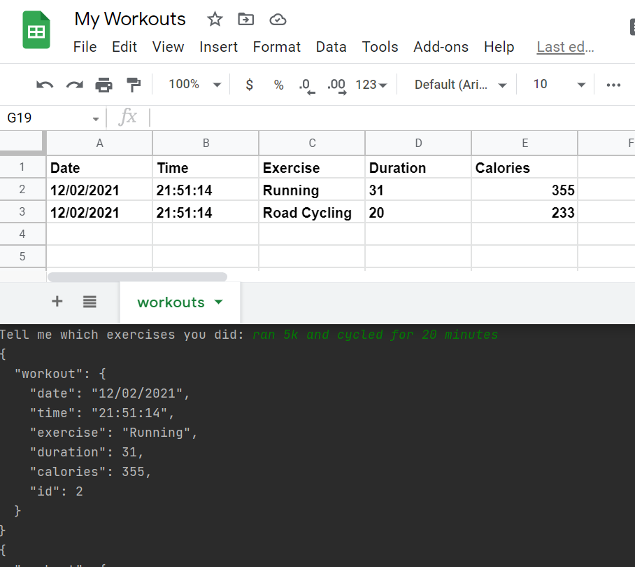

# Workout Tracker
Exercise Tracking with Python and Google Sheets

## I created this project to practice:
- APIs and making POST Requests
- Authorization Headers
- Environment Variables
- Python DateTime strftime()

Therefore, I used the API https://www.nutritionix.com/

## How it works:
The workout tracker works with natural language processing: The exercises can be entered in a normal english sentence, such as "ran 5k and cycled for 20 minutes."
It understands that the activity was running. Then it figures out a duration for the run based on the distance as an average value and works out the amount of calories expended during that activity. 
Then it does the same for the second workout, but here the duration was already given. 
All these activities are logged automatically in a Google sheets file with the current date and time.

